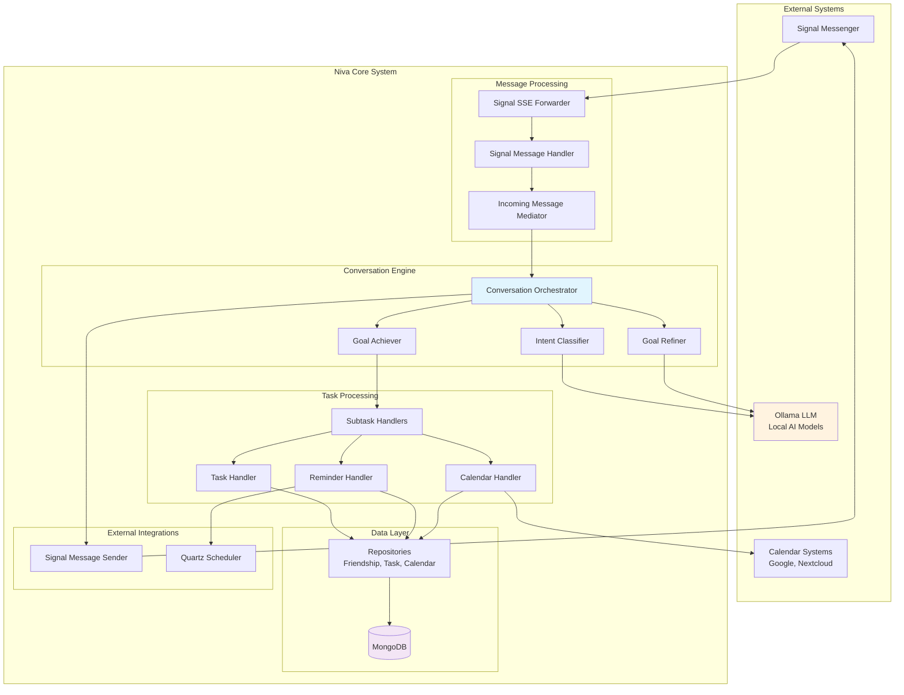
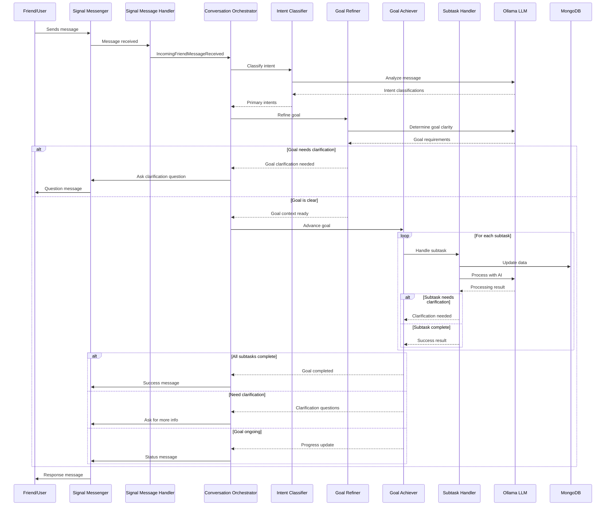

# 🏗️ Niva Architecture Documentation

## Table of Contents
- [Overview](#overview)
- [Core Concepts](#core-concepts)
- [System Architecture](#system-architecture)
- [Conversation Flow](#conversation-flow)
- [Component Details](#component-details)
- [Data Models](#data-models)
- [Integration Points](#integration-points)
- [Deployment Architecture](#deployment-architecture)

---

## Overview

Niva is a sophisticated conversational AI system designed specifically for neurodivergent individuals. The architecture is built around a conversation orchestration pattern that manages complex multi-turn conversations with intelligent goal tracking and subtask management.

### Key Design Principles

1. **🧠 Context Awareness**: Maintains conversation context across multiple interactions
2. **🎯 Goal-Oriented**: Breaks down complex user intentions into manageable subtasks
3. **🔄 Clarification-Driven**: Proactively asks for clarification when needed
4. **🎭 Empathetic Design**: Built with neurodivergent communication patterns in mind
5. **🔧 Extensible**: Modular architecture allows easy addition of new capabilities

---

## Core Concepts

### Friend vs Acquaintance
- **Acquaintance**: New users who haven't accepted terms of service
- **Friend**: Users who have accepted terms and can access full functionality

### Intent-Goal-Subtask Hierarchy
```
Intent → Goal → Subtasks → Actions
```

- **Intent**: What the user wants to do (classified from their message)
- **Goal**: A structured representation of the user's objective
- **Subtask**: Individual steps needed to achieve the goal
- **Action**: Concrete operations performed by subtask handlers

### Conversation Context
The system maintains rich context including:
- Current goal and progress
- Pending clarifications
- User parameters and preferences
- Message history

---

## System Architecture

The following diagram shows the high-level architecture of Niva:



### Architecture Layers

1. **External Systems**: Signal messaging, calendar services, and AI models
2. **Message Processing**: Handles incoming Signal messages and routing
3. **Conversation Engine**: Core intelligence for understanding and managing conversations
4. **Task Processing**: Specialized handlers for different types of user requests
5. **Data Layer**: Persistence and data management
6. **External Integrations**: Outbound services and scheduling

---

## Conversation Flow

The following sequence diagram illustrates how a typical conversation flows through the system:



### Flow Stages

1. **Message Reception**: Signal message is received and processed
2. **Intent Classification**: AI determines what the user wants to do
3. **Goal Refinement**: System clarifies and structures the user's objective
4. **Goal Achievement**: Subtasks are executed to fulfill the goal
5. **Response Generation**: Appropriate response is sent back to the user

---

## Component Details

### 🧠 ConversationOrchestrator
**Location**: `ConversationOrchestrator.kt`
**Purpose**: Central coordinator for all conversation logic

**Key Responsibilities**:
- Receives incoming message events
- Coordinates intent classification and goal refinement
- Manages conversation state and context
- Handles clarification workflows
- Sends responses back to users

**Key Methods**:
- `onMessage()`: Main entry point for incoming messages
- `sendMessage()`: Sends responses to users

### 🎯 IntentClassifier
**Location**: `IntentClassifier.kt`
**Purpose**: AI-powered classification of user intents

**Key Responsibilities**:
- Analyzes user messages using LLMs
- Maintains intent registry and descriptions
- Returns confidence-scored intent classifications
- Handles both single messages and full conversations

**Features**:
- Multi-intent classification with confidence scores
- Context-aware analysis
- Special handling for task addition verification

### 🎨 GoalRefiner
**Location**: `GoalRefiner.kt`
**Purpose**: Converts intents into actionable goals

**Key Responsibilities**:
- Determines if intents require clarification
- Creates goal contexts with subtasks
- Manages goal compatibility with existing contexts
- Handles goal clarification responses

**Key Concepts**:
- Goal determination strategies
- Intent compatibility checking
- Clarification question generation

### ⚡ GoalAchiever
**Location**: `GoalAchiever.kt`
**Purpose**: Executes goals through subtask coordination

**Key Responsibilities**:
- Advances goals by processing subtasks
- Coordinates multiple subtask handlers
- Manages subtask clarification workflows
- Determines goal completion status

**Processing Flow**:
1. Filter incomplete subtasks
2. Find appropriate handlers for each subtask
3. Execute subtasks in parallel
4. Aggregate results and determine next steps

### 🔧 SubtaskHandler Interface
**Location**: `SubtaskHandler.kt`
**Purpose**: Extensible interface for task-specific processing

**Key Methods**:
- `canHandle()`: Determines if handler supports the subtask
- `handle()`: Processes the subtask
- `tryResolveClarification()`: Handles clarification responses

**Implementation Examples**:
- Task management handlers
- Calendar integration handlers
- Reminder management handlers
- Timer handlers

---

## Data Models

### GoalContext
The central data structure maintaining conversation state:

```kotlin
data class GoalContext(
    val goal: Goal? = null,
    val originalMessage: UserMessage? = null,
    val goalClarificationQuestion: GoalClarificationQuestion? = null,
    val subtasks: List<Subtask> = emptyList(),
    val parameters: Map<String, Any?> = emptyMap(),
    val lastUpdated: Instant = Instant.now(),
    val subtaskClarificationQuestions: List<SubtaskClarificationQuestion> = emptyList()
)
```

### Subtask
Individual work units within a goal:

```kotlin
data class Subtask(
    val id: SubtaskId,
    val intent: Intent,
    val description: String = "",
    val parameters: Map<String, Any?> = emptyMap(),
    val status: SubtaskStatus = SubtaskStatus.Pending
)
```

### Intent
Represents what the user wants to accomplish:

```kotlin
data class Intent(val name: String)

// Core system intents
object CoreIntents {
    val Unknown = Intent("Unknown")
    val Smalltalk = Intent("Smalltalk")
    val CancelGoal = Intent("CancelGoal")
    val Help = Intent("Help")
    // ... domain-specific intents
}
```

---

## Integration Points

### 📱 Signal Integration
- **Incoming**: Signal CLI SSE events processed by `SignalCliSseForwarder`
- **Outgoing**: Messages sent via `SignalMessageSender`
- **Authentication**: Signal number registration and verification

### 🗓️ Calendar Integration
- **Supported**: Google Calendar, Nextcloud Calendar
- **Features**: Event synchronization, reminder generation, appointment planning
- **Implementation**: HTTP-based calendar access with credential validation

### 🤖 AI/LLM Integration
- **Platform**: Ollama for local LLM hosting
- **Models**: Configurable models (qwen2.5, others)
- **Usage**: Intent classification, goal refinement, response generation
- **Temperature**: Adjusted per use case (0.0 for classification, higher for generation)

### 💾 Data Persistence
- **Database**: MongoDB for flexible document storage
- **Repositories**: Spring Data MongoDB repositories
- **Converters**: Custom converters for temporal data types
- **Collections**: Friendships, tasks, reminders, conversations, calendars

---

## Deployment Architecture

### 🐳 Container Structure
```
niva/
├── Application Container (Spring Boot)
├── MongoDB Container
├── Ollama Container (LLM)
├── Signal CLI Container
└── Reverse Proxy (optional)
```

### 🔧 Configuration Management
- **Profiles**: Development, production, AI testing
- **Properties**: YAML-based configuration
- **Secrets**: Environment variable injection
- **Feature Flags**: Profile-based feature toggles

### 📊 Monitoring & Observability
- **Logging**: Structured logging with correlation IDs
- **Metrics**: Spring Boot Actuator endpoints
- **Health Checks**: Database, external service connectivity
- **Tracing**: Conversation flow tracing for debugging

### 🔒 Security Considerations
- **Authentication**: Signal number verification
- **Authorization**: Friend vs. acquaintance permissions
- **Data Privacy**: Local LLM processing, minimal data retention
- **Encryption**: Signal end-to-end encryption preserved

---

## Extension Points

### Adding New Subtask Handlers
1. Implement `SubtaskHandler` interface
2. Register with Spring's component scanning
3. Define supported intents
4. Implement processing logic

### Adding New Intents
1. Define intent in appropriate intent registry
2. Add description for intent classification
3. Create subtask generation logic
4. Implement corresponding subtask handler

### Custom Goal Determinators
1. Implement `GoalDeterminator` interface
2. Register with dependency injection
3. Define intent compatibility
4. Implement goal creation logic

---

---

## Behavior-Driven Development

Niva employs comprehensive BDD testing using Cucumber and Gherkin to ensure the system meets real user needs:

### **Feature Coverage**
- 🏠 **User Onboarding**: Registration and consent flows
- ✅ **Task Management**: Natural language task operations
- 📅 **Calendar Integration**: WebDAV/CalDAV connectivity
- ⏰ **Reminders & Timers**: Time-based notifications
- 🌅 **Morning Routines**: Automated daily greetings
- 🔄 **Appointment Follow-ups**: Context-aware task suggestions

### **Example User Scenarios**

```gherkin
Feature: Friends connect their calendar to Fibi
  Scenario: Successfully connects a calendar
    Given a Friend
    And they have a WebDAV calendar
    When they send "I'd like to connect my calendar" to Fibi
    Then they eventually receive a request to post a CalDAV URL
    When they send their CalDAV URL to Fibi
    Then they eventually receive a calendar successfully added message
```

### **Testing Infrastructure**
- **Real Services**: MongoDB, Signal CLI, Radicale Calendar
- **Container Orchestration**: TestContainers for isolation
- **Natural Language**: Tests actual conversation patterns
- **End-to-End**: Full system integration testing

**📁 Location**: [HelloFibi/src/test/resources/features/](../HelloFibi/src/test/resources/features/)

---

This architecture enables Niva to provide sophisticated, context-aware assistance while maintaining the flexibility to evolve and add new capabilities as the neurodivergent community's needs grow. 